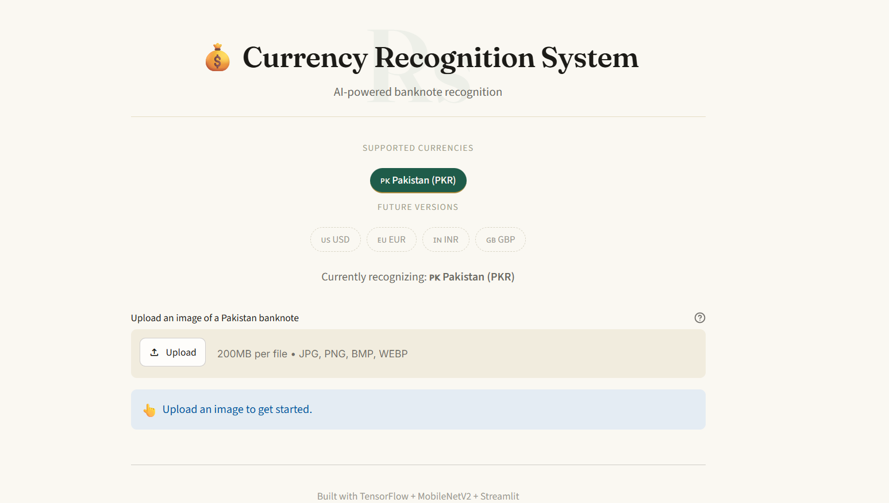
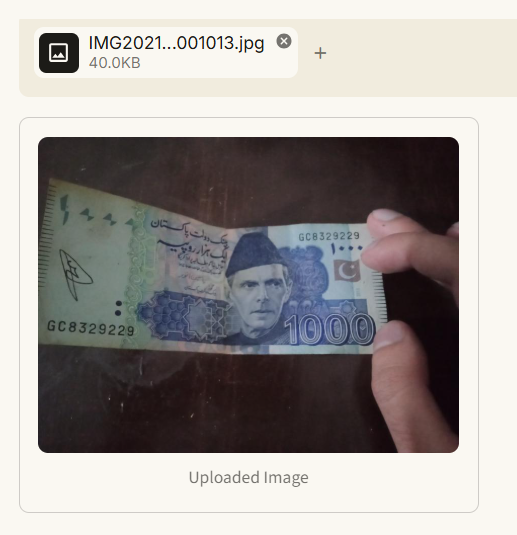
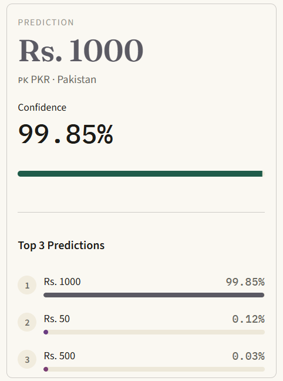

# Currency Recognition System


---

## 📖 Project Overview

**Currency Recognition System** is a deep learning-based web application that identifies the denomination of a currency note from an uploaded image. Built using **MobileNetV2** with transfer learning and served through an interactive **Streamlit** interface, the system currently supports **Pakistani Rupee (PKR)** banknotes.

The architecture is intentionally modular — additional currencies such as USD, EUR, and INR can be integrated in the future without significant changes to the core codebase.

---

## ✨ Features

- 🤖 AI-powered currency denomination recognition
- 📤 Upload images directly through the Streamlit interface
- 🖱️ Drag-and-drop image support
- 🏷️ Displays the predicted denomination
- 📊 Displays the prediction confidence score
- 🥇 Shows Top-3 predictions for transparency
- 🎨 Modern, responsive user interface
- 🌍 Multi-currency ready architecture for future expansion

---

## ⚙️ How It Works

1. The user uploads an image of a currency note through the Streamlit interface.
2. The image is preprocessed (resized and normalized) to match the model's input requirements.
3. The trained **MobileNetV2** model performs inference on the preprocessed image.
4. The application displays:
   - The predicted denomination
   - The confidence score of the prediction
   - The Top-3 most likely predictions

---

## 🛠️ Tech Stack

| Component        | Technology                  |
|-------------------|------------------------------|
| Model Architecture | MobileNetV2 (Transfer Learning) |
| ML Framework       | TensorFlow / Keras          |
| Frontend           | Streamlit                   |
| Language           | Python                      |

---

## 📊 Dataset

- **Total Images:** 3,611
- **Classes:** 7 denominations

| Denomination | Class Label |
|--------------|-------------|
| Rs. 10       | ✅ |
| Rs. 20       | ✅ |
| Rs. 50       | ✅ |
| Rs. 100      | ✅ |
| Rs. 500      | ✅ |
| Rs. 1000     | ✅ |
| Rs. 5000     | ✅ |

**Dataset Split:**

| Split       | Percentage |
|-------------|------------|
| Training    | 70%        |
| Validation  | 15%        |
| Testing     | 15%        |

---

## 📁 Project Structure

```
currency-recognition-system/
│
├── app.py                       # Streamlit application entry point
├── train.py                     # Model training script
├── predict.py                   # Inference / prediction script
├── README.md
├── requirements.txt
│
├── models/
│   ├── currency_model.keras     # Trained MobileNetV2 model
│   ├── class_indices.json       # Class label mappings
│   └── training_curves.png      # Accuracy/loss plots
│
├── dataset/                     # Training, validation & test images
│
├── assets/
│   └── screenshots/              # Application screenshots
│
├── utils/
│   └── currency_registry.py     # Multi-currency configuration logic
│
└── .streamlit/
    └── config.toml               # Streamlit app configuration
```

---

## 💻 Installation

Follow these steps to set up the project locally:

**1. Clone the repository**

```bash
git clone https://github.com/your-username/currency-recognition-system.git
cd currency-recognition-system
```

**2. Create a virtual environment**

```bash
python -m venv .venv
```

**3. Activate the virtual environment (Windows)**

```bash
.venv\Scripts\activate
```

**4. Install requirements**

```bash
pip install -r requirements.txt
```

**5. Run the Streamlit application**

```bash
streamlit run app.py
```

---

## 🚀 Usage

1. Launch the application using the command above.
2. Upload a clear image of a Pakistani Rupee banknote using the upload button or drag-and-drop area.
3. Wait for the model to process the image.
4. View the predicted denomination, confidence score, and Top-3 predictions on the results panel.

---

## 🖼️ Application Preview

**Home Page**



**Upload Screen**


**Uploaded Image**



**Prediction Result**



---

## 📈 Model Performance

| Metric             | Score   |
|---------------------|---------|
| Training Accuracy   | ~93%    |
| Test Accuracy       | 89.3%   |

The model was trained using transfer learning on MobileNetV2, leveraging pre-trained ImageNet weights fine-tuned on the PKR currency dataset.

---

## 🔮 Future Improvements

- 🌍 Add support for additional currencies (USD, EUR, INR, etc.)
- 📱 Deploy as a mobile application
- 🔍 Improve accuracy with a larger and more diverse dataset
- 🧠 Experiment with alternative architectures (EfficientNet, ResNet)
- ☁️ Deploy on cloud platforms for public access
- 🔒 Add fake currency detection capability

---

## 📦 Requirements

```
tensorflow
streamlit
numpy
matplotlib
Pillow
```

*(Full list available in `requirements.txt`)*

---

## 📄 License

This project is licensed under the **MIT License**. See the [LICENSE](LICENSE) file for details.

---

## 👤 Author

**Rimsha**
- GitHub: [@Rimsha392](https://github.com/Rimsha392/currency-recognition-system.git)


---

## 🙏 Acknowledgements

- [TensorFlow](https://www.tensorflow.org/) and [Keras](https://keras.io/) for the deep learning framework
- [Streamlit](https://streamlit.io/) for the interactive web application framework
- [MobileNetV2](https://arxiv.org/abs/1801.04381) architecture by Google
- The open-source community for datasets and inspiration